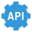

<!-- PROJECT LOGO -->
 

  
  <h3 align="center">API Documenter</h3>
  

    API documentation tool and client for microservices in an organization
     
    <!-- <a href=""><strong>Explore the docs »</strong></a>
     
      -->
    <a href="https://api-documenter.web.app" target="_blank">Visit website</a>
    <!-- ·
    <a href="" target="_blank">Watch Video</a> -->
  

<!-- TABLE OF CONTENTS -->

  
Table of Contents

  <ol>
    <li>
      <a href="#about-the-project">About The Project</a>
      <ul>
        <li><a href="#features">Features</a></li>
        <li><a href="#built-with">Built With</a></li>
      </ul>
    </li>
  </ol>
   

<!-- ABOUT THE PROJECT -->

## About The Project

[![API Documenter][product-screenshot]][website-link]

An application for documenting all APIs for all microservices in an organization. One can also call the API from here and see the results. It provides controls to maintain different levels of access to a user for a microservice.

### Features

- Authentication and Authorization
- Create microservice-bases APIs
- API documentation
- API client
- Save examples
- Environment
- Organize APIs in folders and subfolders
- 

(<a href="#top">Back to top</a>)

### Built With

#### Backend ([Repository Link](https://github.com/parasagrawal71/api-documenter-server))

- [![Node.js][node-icon]][node-url]
- [![Express][express-icon]][express-url]
- [![JavaScript][javascript-icon]][javascript-url]

#### Database

- [![MongoDB][mongodb-icon]][mongodb-url]
- [![Mongoose][mongoose-icon]][mongoose-url] (ODM)

#### Frontend

* [![React][react-icon]][react-url]
* [![Material UI][material-ui-icon]][material-ui-url]
* [![HTML5][html5-icon]][html5-url]
* [![CSS3][css3-icon]][css3-url]
* [![SASS][sass-icon]][sass-url]

#### Deployment

* [![Firebase][firebase-icon]][firebase-url]

(<a href="#top">Back to top</a>)

<!-- MARKDOWN LINKS & IMAGES -->

<!-- PROJECT SPECIFIC LINKS -->

[website-link]: https://api-documenter.web.app

[product-screenshot]: src/assets/images/product-screenshot.png

<!-- SKILLS -->

[react-icon]: https://img.shields.io/badge/React-20232A?style=for-the-badge&logo=react&logoColor=61DAFB
[react-url]: https://reactjs.org/
[vue-icon]: https://img.shields.io/badge/Vue.js-35495E?style=for-the-badge&logo=vuedotjs&logoColor=4FC08D
[vue-url]: https://vuejs.org/
[javascript-icon]: https://img.shields.io/badge/JavaScript-20232A?style=for-the-badge&logo=javascript&logoColor=F7DF1E
[javascript-url]: https://www.javascript.com/
[node-icon]: https://img.shields.io/badge/Node.js-20232A?style=for-the-badge&logo=Node.js&logoColor=339933
[node-url]: https://nodejs.org/en/
[html5-icon]: https://img.shields.io/badge/HTML5-20232A?style=for-the-badge&logo=HTML5&logoColor=E34F26
[css3-icon]: https://img.shields.io/badge/CSS3-20232A?style=for-the-badge&logo=CSS3&logoColor=1572B6
[sass-icon]: https://img.shields.io/badge/SASS-20232A?style=for-the-badge&logo=SASS&logoColor=CC6699
[mongodb-icon]: https://img.shields.io/badge/MongoDB-20232A?style=for-the-badge&logo=MongoDB&logoColor=47A248
[firebase-icon]: https://img.shields.io/badge/firebase-20232A?style=for-the-badge&logo=firebase&logoColor=FFCA28
[material-ui-icon]: https://img.shields.io/badge/Material%20UI-20232A?style=for-the-badge&logo=MUI&logoColor=007FFF
[express-icon]: https://img.shields.io/badge/Express.js-20232A?style=for-the-badge&logo=Express&logoColor=FFFFFF
[mongoose-icon]: https://img.shields.io/badge/Mongoose-20232A?style=for-the-badge

<!-- https://www.markdownguide.org/basic-syntax/#reference-style-links -->

<!-- Get icons from this website => https://simpleicons.org -->
